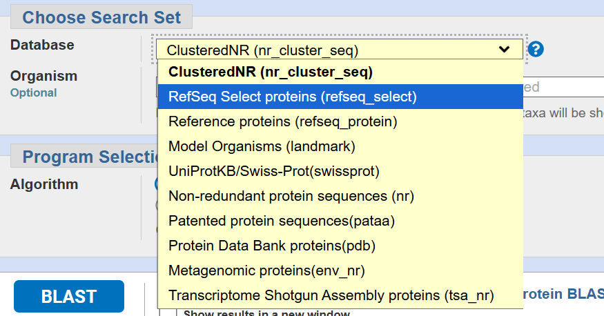
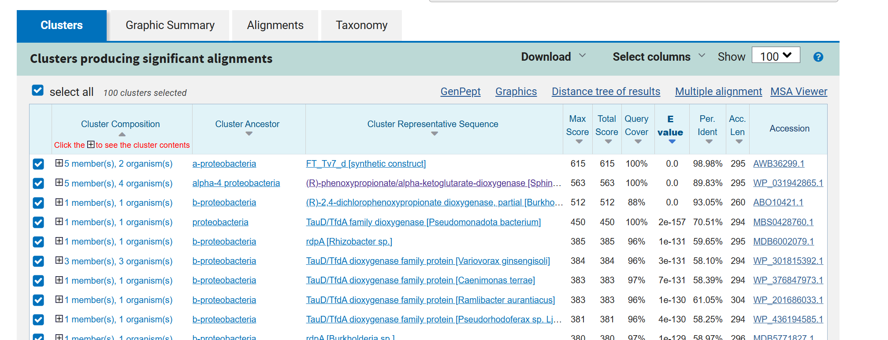

# 国庆假之前需要完成4天的ppt
# D1
1.环境搭建：Linux，VS code，Jupyter notebook
2)超算的登录
3)Linux系统的常用shell命令：vim, ls, cd, less, rm等
4)一些package安装的常用命令：pip, conda, source等 
5)Jupyter notebook的安装和使用
6)VS code的基本配置：连接服务器；选择不同python版本的Interpreter；debug模式的使用等

2.获得同源序列
1)了解不同蛋白质序列库，如UniRef90，UniClust30，Pfam等
2)了解不同工具原理并使用：NCBI BLAST，Jackhmmer，HHblits
3)给定一条蛋白质序列，比对序列库，生成多序列比对（MSA）从AlphaFold2的经典代码仓库中找到它的生成MSA的代码并学习（alphafold/alphafold/data/tools/jackhmmer.py）

3.对MSA进行频率分析
1)使用python的文本文件操作实现
2)使用python中biopython包实现
3)绘制序列Logo，可视化的展示每个位点的氨基酸频率和保守性 

4.序列的同源性计算和进化树的绘制
1)不同同源性的计算方法及应用情景，氨基酸序列的identity和Similarity，BLOSUM62的介绍
2)进化树的绘制
5.基于序列相似性阈值划分训练集和测试集1)为什么要做？避免数据泄露2)选择相似性度量方法3)相似性矩阵的计算4)划分数据集
6.大规模蛋白质序列的聚类分析和去冗余*1)为什么要做？防止过度学习某一类序列特征，消除序列偏差；也能防止训练过程中数据泄露2)聚类方法的选择，CD-HIT、MMseq2和Linclust3)选择代表序列，去冗余4)实际复现S2ALM这一模型文章中的聚类方法

## 给定一条蛋白序列，如何获得其同源序列。
1. 什么是同源序列。
同源序列（homologous sequences）是指在进化历史上具有共同祖先的蛋白质序列。这种同源性通常通过序列相似性来推断，如果两个序列的相似度显著高于随机预期，则表明它们很可能通过从共同祖先的分歧进化而来。对于蛋白质序列，同源序列意味着它们共享相似的结构和功能
2. 为什么要获得同源序列。序列保守性，获得哪些位置是允许突变改造的
获得同源序列的主要目的是理解未知蛋白的功能和进化关系。帮助识别功能相似的蛋白
通过将目标序列与同源序列进行多序列比对（multiple sequence alignment），可以识别保守区域（conserved regions），这些区域在进化中高度相似，通常对应关键的功能位点（如酶活性中心），突变可能破坏蛋白功能。 相反，非保守区域（variable regions）更允许突变或改造，例如，在蛋白工程或抗体人源化中，通过识别保守性低的位点，可以设计突变来优化蛋白质的稳定性、亲和力或免疫原性，而不破坏核心功能。这有助于进化分析、功能预测和定向进化实验

3. 如何获得同源序列。
4. 结果文件的不同格式。

探索序列功能：使用blast
预测结构：使用hmmer之类的工具探索更远的同源序列。

常用工具包括BLAST（Basic Local Alignment Search Tool）
https://blast.ncbi.nlm.nih.gov/Blast.cgi?PROGRAM=blastp&PAGE_TYPE=BlastSearch&BLAST_SPEC=&LINK_LOC=blasttab&LAST_PAGE=blastn

库的来源不同，功能不同。
nr (Non-redundant Protein Sequences)
nr: 非冗余蛋白质序列数据库，包含来自多个来源（如GenBank、RefSeq、UniProt、PDB等）的蛋白质序列，经过处理以减少冗余（即相同序列合并为单一记录）
覆盖广泛的物种和蛋白类型，适合通用同源序列搜索。

1.ClusteredNR使用代表性序列聚类
2.RefSeq Select proteins (refseq_select)
描述：这是RefSeq数据库的一个子集，包含每个物种或基因组中最具代表性且注释最佳的蛋白质序列。RefSeq Select旨在提供单一“首选”序列，减少冗余并提高一致性
3. Reference proteins (refseq_protein)
描述：涵盖NCBI RefSeq数据库中的所有蛋白质序列，包括RefSeq Select序列以及其他补充序列（如未注释或次优序列），覆盖更广的蛋白种类
描述：NCBI curated的高质量参考序列数据库，包含经过验证和注释的蛋白序列，代表物种的典型蛋白。
用途：适合需要高质量、可靠注释的同源序列搜索，数据量比nr小，减少冗余和错误。
特点：序列经过人工审核，适合功能和进化分析。

RefSeq (Reference Sequence Database)
描述：NCBI curated的高质量参考序列数据库，包含经过验证和注释的蛋白序列，代表物种的典型蛋白

准备查询序列（以FASTA格式输入）。
选择数据库（如NCBI的nr数据库、UniProt或Ensembl）。
运行比对：使用BLAST程序（如blastp用于蛋白质），设置参数如E值阈值（通常<0.001表示显著同源）。
筛选结果：基于相似度、覆盖率和E值选择同源序列。

UniProtKB的完整数据库，包含Swiss-Prot（人工审核）和TrEMBL（自动注释，未审核）。
Pfam：基于Pfam数据库的蛋白家族和结构域序列，重点是功能域的同源性。
尤其在序列相似性较低但结构相似的远源同源中。

一般搜索用nr，覆盖最全面。
需要高质量注释用RefSeq或Swiss-Prot。
结构研究用PDB，功能域分析用Pfam或CDD。

AlphaFold2是如何搜索获得蛋白质的同源序列的

### 示例
目的，改造这个酶的序列。
>6D3H_1|Chains A, B, C[auth I], D[auth M]|FT_T dioxygenase|Sphingobium herbicidovorans (76947)
MHAALTPLTNKYRFIDVQPLTGVLGAEITGVDLREPLDDSTWNEILDAFHTYQVIYFPGQAITNEQHIAFSRRFGPVDPVPILKSIEGYPEVQMIRREANESSRFIGDDWHTDSTFLDAPPAAVVMRAIEVPEYGGDTGFLSMYSAWETLSPTMQATIEGLNVVHSATKVFGSLYQATNWRFSNTSVKVMDVDAGDRETVHPLVVTHPVTGRRALYCNQVYCQKIQGMTDAESKSLLQFLYEHATKFDFTCRVRWKKDQVLVWDNLCTMHRAVPDYAGKFRYLTRTTVAGDKPSR
FT_T dioxygenase，是一个双加氧酶

RefSeq Select 包括人类和小鼠每个蛋白质编码基因的一个代表性蛋白质，以及在原核生物的参考和代表性基因组上注释的 RefSeq 蛋白质

PSI-BLAST（Position-Specific Iterated BLAST）是一种迭代蛋白质序列相似性搜索工具，特别适合检测远缘同源序列
A3M（Aligned FASTA/Multiple alignment format）是一种衍生自FASTA的格式，广泛用于结构预测工具（如HHSuite或AlphaFold），其特点是使用小写字母表示插入，点号表示空位对齐。

具体步骤可阅读文章Gapped BLAST and PSI-BLAST: a new generation of protein database search program

NCBI的一篇PSI-BLAST tutorial 中列举了几个实际应用的例子:
https://www.ncbi.nlm.nih.gov/books/NBK2590/
例1: 大肠杆菌DNA聚合酶III的β亚基和真核细胞里的PCNA

β亚基是一个二聚体，每个单体上有三个同源的domain；PCNA是三聚体，每个单体上有两个同源的domain。这些domain都是同源的，包括两个α-螺旋和八个β折叠(PCNA里有九个)。两种蛋白质3D结构极其相似。但以因为进化距离远，BLAST发现不了二者间的相似性。

# Part1
蛋白质序列Blast和PSI-BLAST的使用
1. 同源序列
2. blast的库都是什么
3. 对生成的MSA的分析
4. PSI-BLAST相比与Blast的优势。